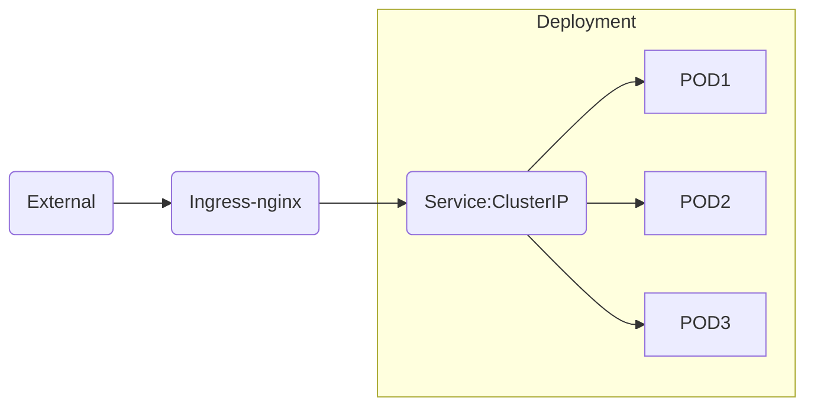

# Ingress

Ingress là thành phần được dùng để điều hướng các yêu cầu traffic thông qua 2 giao thức `HTTP` và `HTTPS` từ external vào các dịch vụ trong Kubernetes

Ingress chỉ để phục vụ các cổng `HTTP`, `HTTPS` còn các loại giao thức khác nếu muốn truy cập từ bên ngoài thì phải sử dụng qua `NodePort` hoặc `LoadBalancer` của `Service`

## Setup ingress

Có rất nhiều giải pháp để phục vụ ingress. Trong bài lab này sẽ hướng dẫn setup ingress dựa trên nginx của kubernetes.

Link tham khảm: https://github.com/kubernetes/ingress-nginx

### Cài đặt

Step 1: Create namespace `ingress-nginx`. Tên namespace có thể tùy chỉnh theo sở thích, tuy nhiên ở đây vẫn nên chọn một namespace mà khi người khác nhìn vô hiểu được namespace đó đang chứa những resources gì

```shell
kubectl create namespace ingress-nginx
```

Step 2: Create một helm values để setup

```shell
$ helm repo add ingress-nginx https://kubernetes.github.io/ingress-nginx
$ helm repo update
$ cat << EOF > values.yaml
controller:
  tolerations:
  - key: node-role.kubernetes.io/control-plane
    effect: NoSchedule
  nodeSelector: {"ingress-ready": "true"}
  hostPort:
    enabled: true
EOF

$ helm install ingress-nginx ingress-nginx/ingress-nginx -n ingress-nginx -f values.yaml
```

Step 3: Kiểm tra lại

```shell
$ kubectl -n ingress-nginx get pod
```

Kết quả của câu command trên
```
NAME                                            READY   STATUS    RESTARTS   AGE
pod/ingress-nginx-controller-54559597cc-2tr2r   1/1     Running   0          42h

NAME                                         TYPE           CLUSTER-IP     EXTERNAL-IP   PORT(S)                      AGE
service/ingress-nginx-controller             LoadBalancer   10.96.82.57    <pending>     80:31877/TCP,443:32501/TCP   42h
service/ingress-nginx-controller-admission   ClusterIP      10.96.226.48   <none>        443/TCP                      42h

NAME                                       READY   UP-TO-DATE   AVAILABLE   AGE
deployment.apps/ingress-nginx-controller   1/1     1            1           42h

NAME                                                  DESIRED   CURRENT   READY   AGE
replicaset.apps/ingress-nginx-controller-54559597cc   1         1         1       42h
replicaset.apps/ingress-nginx-controller-5cc94479c8   0         0         0       42h
```

Trong kubernetes, có thể sử dụng rất nhiều loại `ingress` cùng một lúc tùy thuộc vào nhu cầu của Application. Để lựa chọn loại ingress thì ta chỉ cần truyền thêm tham số ingressClass phù hợp với ingress mong muốn sử dụng.

Để kiểm tra ingress-nginx phía trên đang được set làz ingressClass nào ta sử dụng command sau để check

```shell
$ kubectl -n ingress-nginx get ingressClass
```

Kết quả:
```
NAME    CONTROLLER             PARAMETERS   AGE
nginx   k8s.io/ingress-nginx   <none>       42h
```

***Ví dụ với KongAPI***
```shell
$ kubectl -n kong get IngressClass
# Kết quả
NAME   CONTROLLER                            PARAMETERS   AGE
kong   ingress-controllers.konghq.com/kong   <none>       28s
```

## Sử dụng ingress

### Yêu cầu
Đã triển khai xong deployment và services.

Traffic của ingresss sẽ như sau


### Prompt khởi tạo

Manifest mẫu về ingress

```yaml
# ingress.yaml
apiVersion: networking.k8s.io/v1
kind: Ingress
metadata:
  labels:
    app: guestbook
  name: guestbook
  namespace: default
spec:
  ingressClassName: nginx # ClassName của ingress muốn sử dụng
  rules:
  - host: test.idb.local # Domain Name
    http:
      paths:
      - path: /
        pathType: ImplementationSpecific
        backend:
          service:
            name: guestbook
            port:
              number: 3000 # Port trên services guestbook
```

Chạy command sau để tạo ingress

```shell
$ kubectl -f nginx.yaml create
```

Kiểm tra lại

```shell
$ kubectl get ingress

# Kết quả
NAME        CLASS   HOSTS            ADDRESS   PORTS   AGE
guestbook   nginx   test.idb.local             80      26s
```

Do đây là domain test, nên add static host trong `/etc/hosts` đối với linux, hoặc `C:\Windows\System32\drivers\etc\hosts` chỉnh với nội dung sau

```shell
<IP_Node> <Domain>

# Ví dụ
103.146.20.203 test.idb.local
```

Mở trình duyệt và kiểm tra lại domain http://test.idb.local

### Customize với nginx

Do ingress dựa trên nginx nên cũng có rất nhiều options liên quan đến với tinh chỉnh nginx như khi cài trên một máy chủ bình thường. Bao gồm như các thông số như:

- ProxyConnectTimeOut
- ProxyBuffer
- ProxyReadTimeout
- ....

Tham khảm ở trang này: https://github.com/kubernetes/ingress-nginx/blob/main/docs/user-guide/nginx-configuration/annotations.md

Để hiệu chỉnh các chỉ số ở đây: ta chỉnh trong lại trong file manifest sử dụng session affinity

```yaml
apiVersion: networking.k8s.io/v1
kind: Ingress
metadata:
  annotations:
    nginx.ingress.kubernetes.io/affinity: cookies # Session affinity dựa trên cookies
  labels:
    app: guestbook
  name: guestbook
  namespace: default
spec:
  ingressClassName: nginx # ClassName của ingress muốn sử dụng
  rules:
  - host: test.idb.local # Domain Name
    http:
      paths:
      - path: /
        pathType: ImplementationSpecific
        backend:
          service:
            name: guestbook
            port:
              number: 3000
```

Các chỉ số của host sẽ được để trong trường `metadata.annonations`

Ví dụ các annonations hay dùng:
- nginx.ingress.kubernetes.io/proxy-body-size: tunning lại body size -> các application cần trong việc upload/download. Các API liên quan đến upload hình ảnh
- nginx.ingress.kubernetes.io/proxy-send-timeout | nginx.ingress.kubernetes.io/proxy-read-timeout | nginx.ingress.kubernetes.io/proxy-connect-timeout: tunning thời gian kết nối đến upstream.
- nginx.ingress.kubernetes.io/auth-proxy-set-headers: thêm các header xuống backend
- nginx.ingress.kubernetes.io/backend-protocol: điều chỉnh lại protocol xuống backend ví dụ như HTTP/ HTTPS
- nginx.ingress.kubernetes.io/enable-cors: enable/disable CORS
- nginx.ingress.kubernetes.io/limit-rps: limit rate per second
- nginx.ingress.kubernetes.io/limit-connections: limit số connection
- nginx.ingress.kubernetes.io/server-snippet: custom edit nginx

```yaml
apiVersion: networking.k8s.io/v1
kind: Ingress
metadata:
  annotations:
    nginx.ingress.kubernetes.io/server-snippet: |
        set $agentflag 0;

        if ($http_user_agent ~* "(Mobile)" ){
          set $agentflag 1;
        }

        if ( $agentflag = 1 ) {
          return 301 https://m.example.com;
        }
```
