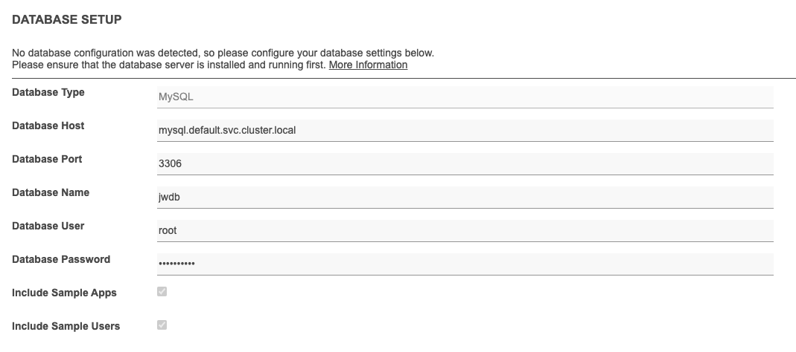

# Joget with Kubernetes (KIND)


Tạo cluster có mount volume để sử dụng Persistent Volume cho các dịch vụ DB
## Create cluster with kind
```yaml
# cluster.yaml
kind: Cluster
apiVersion: kind.x-k8s.io/v1alpha4
name: cluster-pv
nodes:
- role: control-plane
  kubeadmConfigPatches:
  - |
    kind: InitConfiguration
    nodeRegistration:
      kubeletExtraArgs:
        node-labels: "ingress-ready=true"
  extraPortMappings:
  - containerPort: 80
    hostPort: 80
    protocol: TCP
  - containerPort: 443
    hostPort: 443
    protocol: TCP
  extraMounts:
  - hostPath: ./kind-pvc-hostpath.yaml
    containerPath: /kind/manifests/default-storage.yaml
  - hostPath: /tmp/hostpath-provisioner
    containerPath: /tmp/hostpath-provisioner
- role: worker
  extraMounts:
  - hostPath: /tmp/hostpath-provisioner
    containerPath: /tmp/hostpath-provisioner
- role: worker
  extraMounts:
  - hostPath: /tmp/hostpath-provisioner
    containerPath: /tmp/hostpath-provisioner
- role: worker
  extraMounts:
  - hostPath: /tmp/hostpath-provisioner
    containerPath: /tmp/hostpath-provisioner
```

Trong file cluster trên là sẽ tạo ra 4 nodes trong đó có 1 master và 3 worker.

Chạy command sau:

```shell
$ kind create cluster --config cluster.yaml
Creating cluster "cluster-pv" ...
 ✓ Ensuring node image (kindest/node:v1.27.3) 🖼
 ✓ Preparing nodes 📦 📦 📦 📦
 ✓ Writing configuration 📜
 ✓ Starting control-plane 🕹️
 ✓ Installing CNI 🔌
 ✓ Installing StorageClass 💾
 ✓ Joining worker nodes 🚜
Set kubectl context to "kind-cluster-pv"
You can now use your cluster with:

kubectl cluster-info --context kind-cluster-pv

Have a question, bug, or feature request? Let us know! https://kind.sigs.k8s.io/#community 🙂
root@trungn-labs-01:~/kind/pvc# kubectl cluster-info --context kind-cluster-pv
Kubernetes control plane is running at https://127.0.0.1:43855
CoreDNS is running at https://127.0.0.1:43855/api/v1/namespaces/kube-system/services/kube-dns:dns/proxy

To further debug and diagnose cluster problems, use 'kubectl cluster-info dump'.

# Run below command to change set context
$ kubectl cluster-info --context kind-cluster-pv
```
## Storage Class

Giống như ingress, Persistent Volume trong kubernetes có thể được cung cấp bới rất nhiều bên thứ ba thông qua CSI (Container Storage Interface). Ví dụ như các engine như longhorn, ceph rbd, cephfs, ceph rock, GKE, EKS

Trong bài labs này, ta sẽ tạo mốt storageClass tương ứng với hostPath. Nghĩa là sử dụng các disk local của node để làm nơi lưu trữ.
```yaml
# kind-pvc-hostpath.yaml
---
apiVersion: v1
kind: Namespace
metadata:
  name: local-storage # Create namespace local-storage
---
apiVersion: v1
kind: ServiceAccount
metadata:
  name: hostpath-provisioner # Create service-account
  namespace: local-storage
---
kind: ClusterRole
apiVersion: rbac.authorization.k8s.io/v1
metadata:
  name: hostpath-provisioner # Create role cluster-role
rules:
  - apiGroups: [""]
    resources: ["persistentvolumes"]
    verbs: ["get", "list", "watch", "create", "delete"]
  - apiGroups: [""]
    resources: ["persistentvolumeclaims"]
    verbs: ["get", "list", "watch"]
  - apiGroups: ["storage.k8s.io"]
    resources: ["storageclasses"]
    verbs: ["get", "list", "watch"]
  - apiGroups: [""]
    resources: ["events"]
    verbs: ["create", "update", "patch"]
---
kind: ClusterRoleBinding
apiVersion: rbac.authorization.k8s.io/v1
metadata:
  name: hostpath-provisioner 
subjects:
  - kind: ServiceAccount
    name: hostpath-provisioner
    namespace: local-storage
roleRef:
  kind: ClusterRole
  name: hostpath-provisioner
  apiGroup: rbac.authorization.k8s.io
---
kind: Role
apiVersion: rbac.authorization.k8s.io/v1
metadata:
  name: leader-locking-hostpath-provisioner
  namespace: local-storage
rules:
  - apiGroups: [""]
    resources: ["endpoints"]
    verbs: ["get", "update", "patch"]
  - apiGroups: [""]
    resources: ["endpoints"]
    verbs: ["list", "watch", "create"]
---
kind: RoleBinding
apiVersion: rbac.authorization.k8s.io/v1
metadata:
  name: leader-locking-hostpath-provisioner
  namespace: local-storage
subjects:
  - kind: ServiceAccount
    name: hostpath-provisioner
    namespace: local-storage
roleRef:
  kind: Role
  name: leader-locking-hostpath-provisioner
  apiGroup: rbac.authorization.k8s.io
---
apiVersion: apps/v1
kind: Deployment
metadata:
  name: hostpath-provisioner
  namespace: local-storage
  labels:
        app: hostpath-provisioner
spec:
  replicas: 3
  selector:
    matchLabels:
      app: hostpath-provisioner
  template:
    metadata:
      labels:
        app: hostpath-provisioner
    spec:
      containers:
        - name: hostpath-provisioner
          image: mauilion/hostpath-provisioner:dev
          imagePullPolicy: "IfNotPresent"
          env:
            - name: NODE_NAME
              valueFrom:
                fieldRef:
                  fieldPath: spec.nodeName
          volumeMounts:
            - name: pv-volume
              mountPath: /tmp/hostpath-provisioner
      serviceAccountName: hostpath-provisioner
      volumes:
      - name: pv-volume
        hostPath:
          path: /tmp/hostpath-provisioner
---
kind: StorageClass
apiVersion: storage.k8s.io/v1
metadata:
  name: standard
  annotations:
    storageclass.kubernetes.io/is-default-class: "true"
reclaimPolicy: Retain
provisioner: example.com/hostpath
```

```shell
$ kubectl -f kind-pvc-hostpath.yaml create

$ kubectl get storageclasses.storage.k8s.io
NAME                 PROVISIONER            RECLAIMPOLICY   VOLUMEBINDINGMODE   ALLOWVOLUMEEXPANSION   AGE
standard (default)   example.com/hostpath   Retain          Immediate           false                  29m

# Ví dụ một cluster khác
$ kubectl get storageclasses.storage.k8s.io
NAME                 PROVISIONER          RECLAIMPOLICY   VOLUMEBINDINGMODE   ALLOWVOLUMEEXPANSION   AGE
longhorn (default)   driver.longhorn.io   Delete          Immediate           true                   181d

# Một ví dụ khác của cluster
$ kubectl get storageclasses.storage.k8s.io
NAME                    PROVISIONER          RECLAIMPOLICY   VOLUMEBINDINGMODE   ALLOWVOLUMEEXPANSION   AGE
ceph-hdd-01 (default)   rbd.csi.ceph.com     Delete          Immediate           true                   160d
ceph-ssd-01             rbd.csi.ceph.com     Delete          Immediate           true                   161d
longhorn                driver.longhorn.io   Delete          Immediate           true                   4d3
```


## Install DB

Trong bài labs này sẽ hướng dẫn tạo DB MySQL bằng helm.

```yaml
#values-helm-db.yaml
global:
  storageClass: standard    
```

Install DB
```shell
$ helm install mysql oci://registry-1.docker.io/bitnamicharts/mysql -f values-helm-db.yaml
Execute the following to get the administrator credentials:

  echo Username: root
  MYSQL_ROOT_PASSWORD=$(kubectl get secret --namespace default mysql -o jsonpath="{.data.mysql-root-password}" | base64 -d)

To connect to your database:

  1. Run a pod that you can use as a client:

      kubectl run mysql-client --rm --tty -i --restart='Never' --image  docker.io/bitnami/mysql:8.0.35-debian-11-r0 --namespace default --env MYSQL_ROOT_PASSWORD=$MYSQL_ROOT_PASSWORD --command -- bash

  2. To connect to primary service (read/write):

      mysql -h mysql.default.svc.cluster.local -uroot -p"$MYSQL_ROOT_PASSWORD"


# Kiểm tra lại
$ kubectl get pod
NAME      READY   STATUS    RESTARTS   AGE
mysql-0   1/1     Running   0          5m24s

$ kubectl get pv
NAME                                       CAPACITY   ACCESS MODES   RECLAIM POLICY   STATUS   CLAIM                  STORAGECLASS   REASON   AGE
pvc-340ad867-1980-4ecc-b17f-2ef87ddd7168   8Gi        RWO            Retain           Bound    default/data-mysql-0   standard                5m35s

$ kubectl get pvc
NAME             STATUS    VOLUME                                     CAPACITY   ACCESS MODES   STORAGECLASS   AGE
data-mysql-0     Bound     pvc-340ad867-1980-4ecc-b17f-2ef87ddd7168   8Gi        RWO            standard       6m27s
```

## Setup ingress

Theo lab 03_ingress.md

## Setup Joget
```yaml
---
apiVersion: v1
kind: PersistentVolumeClaim
metadata:
  name: joget-dx7-tomcat9-pvc
spec:
  accessModes:
    - ReadWriteOnce
  volumeMode: Filesystem
  resources:
    requests:
      storage: 1Gi
  storageClassName: standard
---
apiVersion: apps/v1
kind: Deployment
metadata:
  name: joget-dx7-tomcat9
  labels:
    app: joget-dx7-tomcat9
spec:
  replicas: 1
  selector:
    matchLabels:
      app: joget-dx7-tomcat9
  template:
    metadata:
      labels:
        app: joget-dx7-tomcat9
    spec:
      volumes:
        - name: joget-dx7-tomcat9-pv
          persistentVolumeClaim:
            claimName: joget-dx7-tomcat9-pvc
      securityContext:
        runAsUser: 1000
        fsGroup: 0
      containers:
        - name: joget-dx7-tomcat9
          image: jogetworkflow/joget-dx7-tomcat9:latest
          ports:
            - containerPort: 8080
          volumeMounts:
            - name: joget-dx7-tomcat9-pv
              mountPath: /opt/joget/wflow
          env:
            - name: KUBERNETES_NAMESPACE
              valueFrom:
                fieldRef:
                    fieldPath: metadata.namespace
---
apiVersion: v1
kind: Service
metadata:
  name: joget-dx7-tomcat9
  labels:
    app: joget-dx7-tomcat9
spec:
  ports:
  - name: http
    port: 8080
    targetPort: 8080
  - name: https
    port: 9080
    targetPort: 9080
  selector:
    app: joget-dx7-tomcat9
  type: NodePort
---
apiVersion: rbac.authorization.k8s.io/v1
kind: ClusterRoleBinding
metadata:
  name: joget-dx7-tomcat9-clusterrolebinding
roleRef:
  apiGroup: rbac.authorization.k8s.io
  kind: ClusterRole
  name: view
subjects:
  - kind: ServiceAccount
    name: default
    namespace: default
---
apiVersion: networking.k8s.io/v1
kind: Ingress
metadata:
  name: joget-dx7-tomcat9-ingress
  annotations:
    nginx.ingress.kubernetes.io/affinity: cookie
    # nginx.ingress.kubernetes.io/rewrite-target: /
spec:
  ingressClassName: nginx
  rules:
    - host: joget.idb.local
      http:
        paths:
          - path: /jw
            pathType: Prefix
            backend:
              service:
                name: joget-dx7-tomcat9
                port:
                  number: 8080
```



